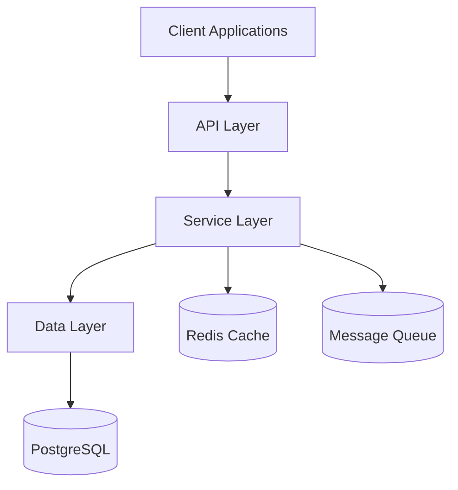
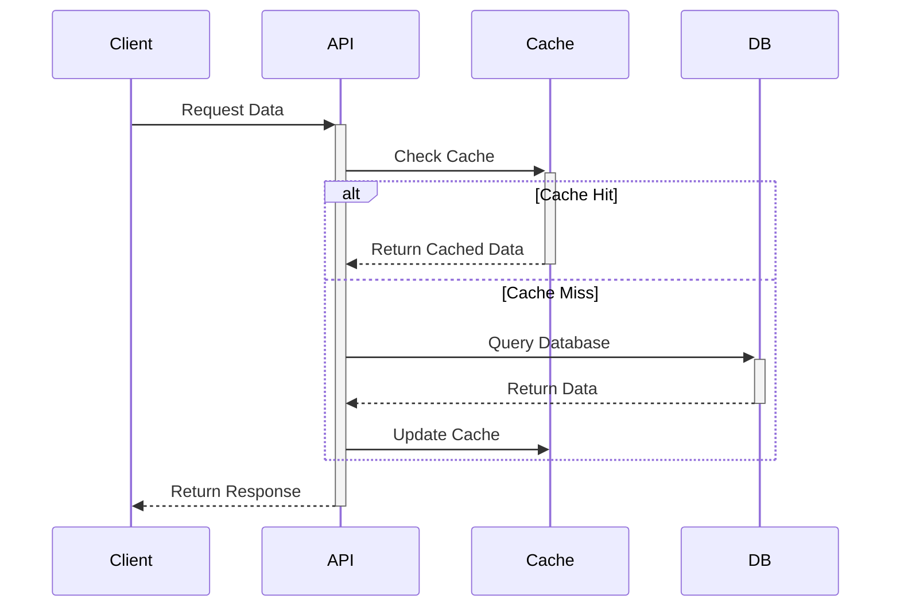
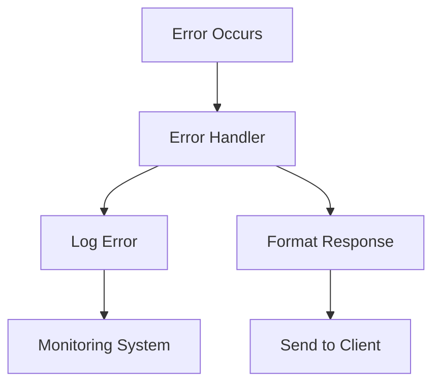
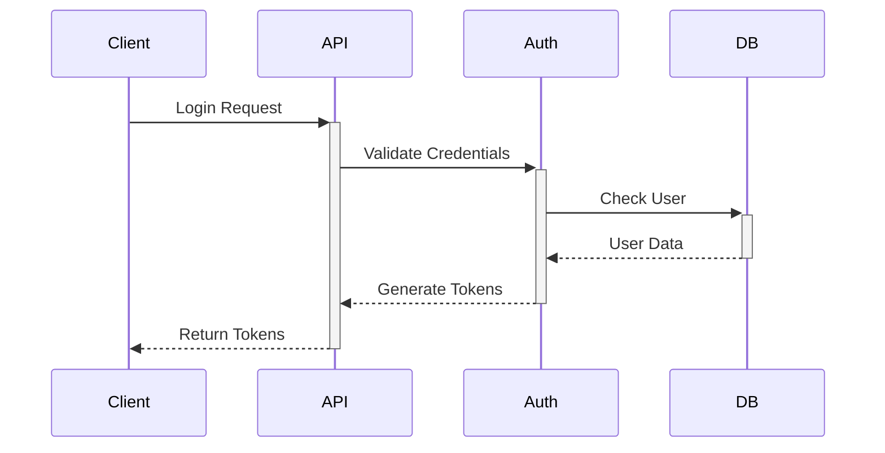

# CloudScribe Architecture

## Overview
CloudScribe is built using a modular, service-oriented architecture following clean architecture principles. The application is divided into distinct layers with clear responsibilities.

## System Architecture

## Layers

### API Layer
- Routes: Handle HTTP requests and route them to appropriate controllers
- Controllers: Handle request/response cycle and delegate business logic to services
- Validation: Input validation using Zod schemas
- Middleware: Cross-cutting concerns like authentication, logging, etc.

### Service Layer
- Business Logic: Core application logic
- Data Access: Interaction with database through Prisma ORM
- External Services: Email, caching, notifications, etc.

### Data Layer
- Models: Prisma schema definitions
- Migrations: Database structure version control
- Seeds: Initial data population

## Key Components

### Authentication
- JWT-based authentication
- Role-based access control
- Session management

### Caching
- Redis-based caching
- Multiple caching strategies
- Cache invalidation patterns

### Security
- Request validation
- SQL injection protection
- XSS protection
- Rate limiting
- IP blocking

### Monitoring
- Logging with Winston
- Audit trails
- Error tracking
- Performance monitoring

## Technical Stack

### Backend
- Node.js & Express.js
- PostgreSQL with Prisma ORM
- Redis for caching
- Bull for job queues

### Testing
- Jest for unit testing
- Supertest for API testing

### DevOps
- Docker & Docker Compose
- GitHub Actions for CI/CD

## Data Flow

### Request Lifecycle
1. Client makes HTTP request
2. Middleware processes request (auth, validation)
3. Controller receives request
4. Service layer handles business logic
5. Data layer interacts with database
6. Response flows back through layers

### Caching Strategy

## Error Handling

### Error Types
- ValidationError: Invalid input data
- AuthError: Authentication/authorization issues
- BusinessError: Business rule violations
- SystemError: Internal system errors

### Error Flow

## Scalability Considerations

### Horizontal Scaling
- Stateless API design
- Redis for session storage
- Load balancing ready

### Performance Optimization
- Query optimization
- Efficient caching
- Background job processing

## Security Architecture

### Authentication Flow

### Authorization Levels
1. Public Routes
2. Authenticated Routes
3. Role-Based Routes
4. Permission-Based Routes

## Directory Structure 